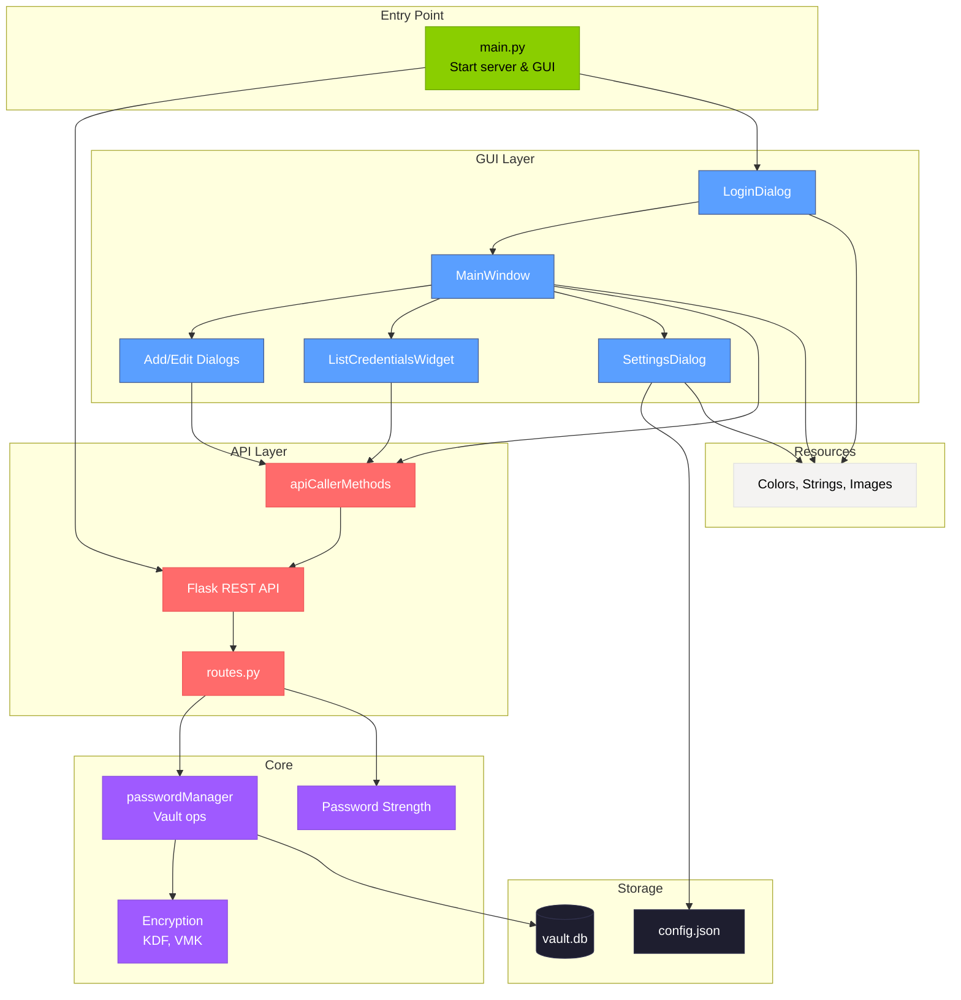

# Offline Password Manager
A local password manager that lets you securely store and retrieve your account passwords. Each password is encrypted with a master key before being saved in a local SQLite database, so it is protected even if someone accesses your files. The program can generate strong random passwords for new accounts, and you can add or get credentials through a simple local API. Everything runs on your computer without needing an internet connection. 

# How to run
## To run the latest release
1. Go to the 'Releases' page to the right
2. Select the release compatible with your Operating System

### For Mac:
The project must be built from source using the instruction below.


## To run from the source code
- Download the latest binary from the Release section on the right on GitHub.  
- On the command line start virtual environment:
```
 python3 -m venv venv  
```
- On the command line activate venv.
```
source venv/bin/activate
```

Install requirements:
```
pip install -r requirements.txt

```
Run code:
```
python3 main.py
```

# How to contribute
Follow this project board to know the latest status of the project: [https://github.com/orgs/cis3296f25/projects/71]  

### How to build
- Use this github repository: ... 
- Specify what branch to use for a more stable release or for cutting edge development.  
- Use InteliJ 11
- Specify additional library to download if needed 
- What file and target to compile and run. 
- What is expected to happen when the app start.

# Component Diagram


This diagram shows how the password manager is built. The GUI (blue boxes) is what users see - login screen, main window, dialogs for adding/editing passwords. When you do something in the GUI, it sends HTTP requests through the API layer (red boxes) to the core logic (purple boxes), which handles encryption and saves everything to the database. Even though it's a desktop app, we use a REST API internally so the GUI doesn't have to know about encryption or databases - it just makes requests and gets responses back. The whole thing starts from main.py which fires up both the web server and the GUI.
