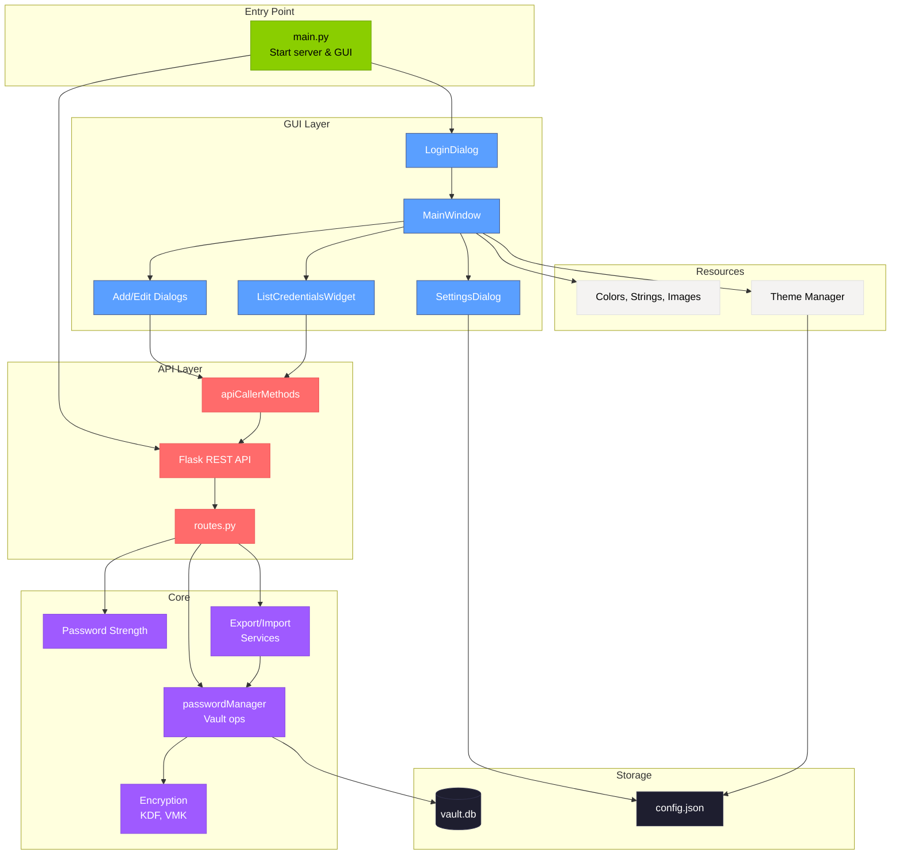

<h1 align="center"> Offline Password Manager</h1>
<p align="center">
 <i>A local password manager that lets you securely store and retrieve your account passwords.</i>
 <br/><br/>

</p>

# Overview
Each password is encrypted with a master key before being saved in a local SQLite database, so it is protected even if someone accesses your files. The program can generate strong random passwords for new accounts, and you can add or get credentials through a simple local API. Everything runs on your computer without needing an internet connection. 

<br></br>

<div align="center">
 
| Login | Dashboard | 
| :---:         |     :---:      |     
|    |      |
</div>

# Security & Encryption Architecture

This password manager uses industry-standard encryption practices to ensure your passwords remain secure even if someone gains access to your database file. Here's how your data is protected:

## Two-Layer Encryption Model

### Layer 1: Master Password Protection
Your master password is **never stored** in the database. Instead, it's used to unlock a Vault Master Key (VMK) that encrypts all your passwords.

**Account Creation Process:**
1. **Random Salt Generation**: A unique 16-byte random salt is generated for each account using cryptographically secure randomness (`os.urandom`). This prevents rainbow table attacks (even if two users have the same master password, their encryption keys will be different).
2. **Key Derivation**: Your master password is combined with the salt and processed through **Argon2id**, a memory-hard key derivation function. It converts your password into a 32-byte wrap key using:
   - Time cost: 3 iterations
   - Memory cost: 64 MiB
   - Parallelism: 2 threads
   - This makes brute-force attacks computationally expensive (requiring significant time and memory).
3. **VMK Generation**: A random 32-byte (256-bit) Vault Master Key (VMK) is generated using Fernet's secure key generation. This key will actually encrypt all your stored passwords.
4. **VMK Wrapping**: The VMK is encrypted (wrapped) using the wrap key derived from your master password. The wrapped VMK, salt, and KDF parameters are stored in the database. The VMK itself is never stored in plaintext.

**What's Stored:**
- Your username
- Encrypted VMK (can only be decrypted with your master password)
- Random salt (unique per account)
- KDF algorithm name and parameters (Argon2id settings)  

**What's NOT Stored:**
- Your master password (not even a hash)
- The VMK in plaintext
- Any passwords in plaintext

### Layer 2: Password Encryption
When you save a password to the vault:

1. **Encryption**: Each password is encrypted using the VMK via Fernet symmetric encryption (AES-128 in CBC mode with HMAC authentication). Fernet provides authenticated encryption, ensuring both confidentiality and integrity.
2. **Storage**: Only the encrypted password (binary blob) is stored in the database along with the site name and username.

# How to run
## To run the latest release
1. Go to the 'Releases' page to the right
2. Select the release compatible with your Operating System

## How To Build: To Run From The Source Code
- Download the latest binary from the Release section on the right on GitHub.  
- On the command line start virtual environment:
```
 python3 -m venv venv  
```
- On the command line activate venv.
```
source venv/bin/activate
```

Install requirements:
```
pip install -r requirements.txt

```
Run code:
```
python3 main.py
```

# Usage Overview
## Account Creation
Enter a username and master password, then click "Create Account". You will be asked to confirm the password, and once confirmed you will be logged in.

## Login
Enter your username and master password, then click "Login". After 3 failed attempts, login will be temporarily locked.

## Adding a Password to the Vault
Click the "Add" button, fill in the site, username, and password fields. You can generate a strong password using the "Generate Password" button. The dialog shows password strength feedback. Click "Save Credential" to store it. Use the search bar to find credentials, and the filter button to sort by date or site name (A–Z or Z–A).

## Delete and Edit
Each credential card displays edit and delete buttons. Click edit to modify site, username, or password. Click delete to remove a credential from the vault.

## Changing the Master Password
Open Settings (gear icon), then click "Change Password". Enter your old password and new password, then click "Submit".

## All Other User-Configurable Settings
Open Settings (gear icon) to access:
- **Themes**: Choose color palette (Default, Red, Green, Blue, Purple) and light/dark mode
- **Export**: Export credentials as JSON or CSV (plaintext warning shown)
- **Import**: Import credentials from a CSV file with headers: site, username, password

## Export/Import
- Export:
  - Via Settings > Export: choose JSON (default) or CSV. Confirms plaintext risk, then saves locally.
  - API: GET /export?format=json|csv
    - JSON: { "version": 1, "exported_at": "...", "items": [ { "site","username","password" } ] }
    - CSV: header is `site,username,password`
- Import (CSV):
  - Via Settings > Import CSV: select a CSV with header site,username,password.
  - API: POST /import with text or csv body.
  - Skips duplicates (site+username). Shows inserted/skipped/errors.
- Note: Files contain plaintext passwords. Store securely and delete when done

## Logout
Click the "Logout" button in the main window. This locks the vault and returns you to the login screen.

## Running the App Portably via USB:
Place the executable **and** database file (`vault.db`) in the same directory on a USB. You'll be able to run the program and access all your passwords on any device by running the app from the USB on that device, without storing any information on that device.

# Component Diagram


This diagram shows how the password manager is built. The GUI (blue boxes) is what users see - login screen, main window, dialogs for adding/editing passwords. When you do something in the GUI, it sends HTTP requests through the API layer (red boxes) to the core logic (purple boxes), which handles encryption and saves everything to the database. Even though it's a desktop app, we use a REST API internally so the GUI doesn't have to know about encryption or databases - it just makes requests and gets responses back. The whole thing starts from main.py which fires up both the web server and the GUI.

# Contributors
<a href="https://github.com/cis3296f25/PasswordManager/graphs/contributors">
  
</a>

Made with [contrib.rocks](https://contrib.rocks).

# How to contribute
Follow this project board to know the latest status of the project: [https://github.com/orgs/cis3296f25/projects/71]  
